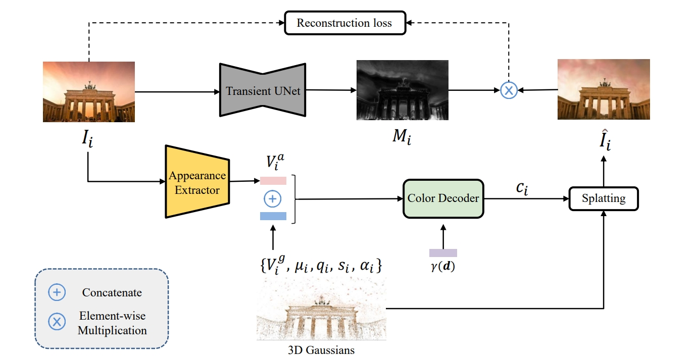

# AAGS: Appearance-Aware 3D Gaussian Splatting for Unconstrained Photo Collections



> **AAGS: Appearance-Aware 3D Gaussian Splatting for Unconstrained Photo Collections**
>
> Wencong Zhang, Zhiyang Guo, Wengang Zhou and Houqiang Li

## Installation

Follow the instructions in [gaussian-splatting](https://github.com/graphdeco-inria/gaussian-splatting) to setup the environment and submodules, after that, you need to install [tiny-cuda-nn](https://github.com/NVlabs/tiny-cuda-nn).

The code is tested on:
   
```
OS: Ubuntu 22.04
GPU: RTX 3090
CUDA: 11.8
Python: 3.9
Pytorch: 2.0.1+cu118
tinycudann: 1.7
```

## Data download

Download the scenes you want from [here](https://www.cs.ubc.ca/~kmyi/imw2020/data.html) 

Download the train/test split from [here](https://nerf-w.github.io/) and put under each scene's folder (the **same level** as the "dense" folder)

## Training model

Run (example)
```
CUDA_VISIBLE_DEVICES=0 \
python train.py \
    --source_path /data/dataset/nerf_wild/brandenburg_gate/dense \
    --exp_name gate --iterations 30_000 --convert_SHs_python \
    --resolution 2 --min_opacity 0.005 \
    --images images \
    --densify_until_iter 15_000 \
    --densify_grad_threshold 0.0002 --a_enc --mask_unet --maskrs_k 0.00012
```

Add `--a_enc` for using appearance module, `--mask_unet` for using anti-occlusion module.

Or just run
```
sh benchmark_wild.sh
```

## Model weights

You can download our model weights [here](https://pan.baidu.com/s/1zXj_eHFx1OCoFu85mtpSxg?pwd=sp94) (code:sp94) and run
```
$ python render.py --model_path "model_weights/point_cloud/iteration_30000"
```